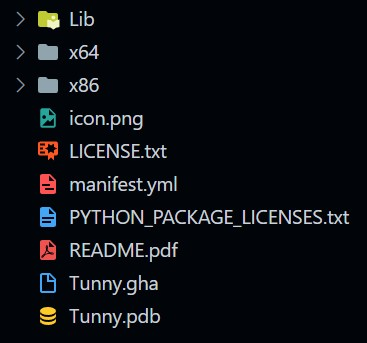

# How to push PackageManager

- official document
  - https://developer.rhino3d.com/guides/yak/

## Summary

1. Build component
1. Update version info in manifest.yml
1. Move some items to package folder like following.
    - 
1. Use `"C:\Program Files\Rhino 7\System\Yak.exe" build` command to build yak package.
1. Rename the package to tunny-x.y.z-rh7-win.yak
   - Since tunny is not running on rhino6 and mac.
1. Use `"C:\Program Files\Rhino 7\System\Yak.exe" push tunny-x.y.z-rh7-win.yak` command to push the package to Rhino PackageManager.
1. Finish!